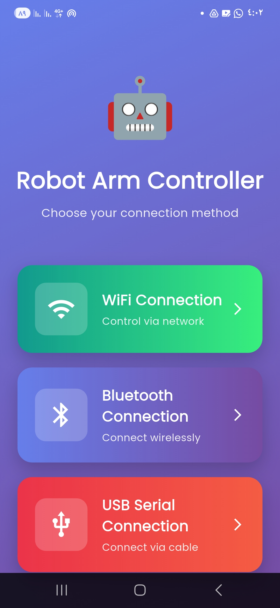
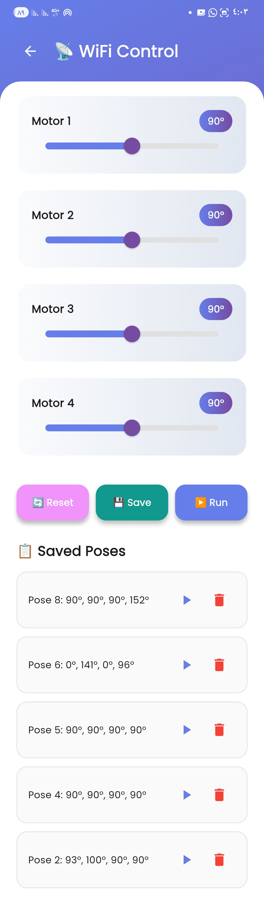
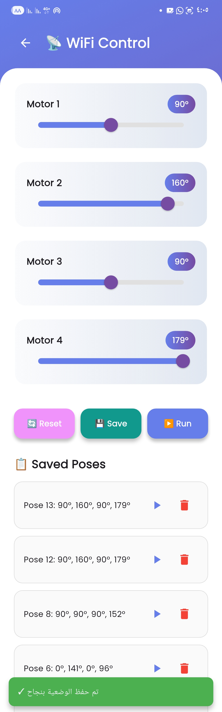
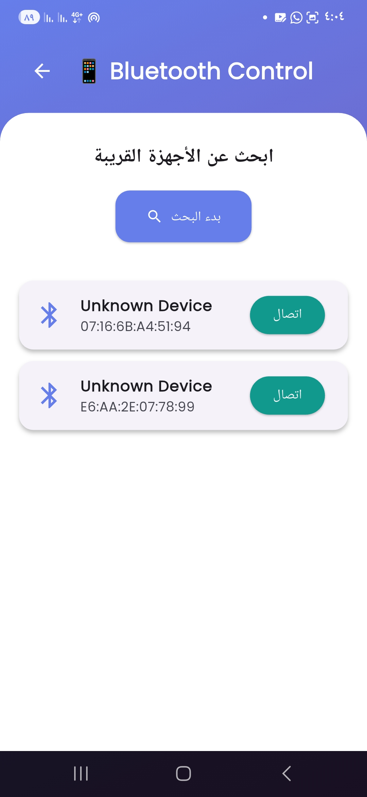

# 🤖 تطبيق فلاتر للتحكم بذراع روبوت (Robot Arm Controller)

<div align="center">

[](https://flutter.dev)
[](https://dart.dev)
[](https://php.net)
[](https://www.mysql.com)

**تطبيق جوال متكامل ومتقدم وتفاعلي للتحكم بذراع روبوت عبر 3 طرق اتصال مختلفة**

[المميزات](#-المميزات-الرئيسية) • [معرض الصور](#️-معرض-الصور) • [فيديو العرض](#-فيديو-العرض) • [التحديات](#-رحلة-البناء-والتحديات) • [التثبيت](#-دليل-التثبيت)

</div>

---

## 📖 نظرة عامة

هذا المشروع هو **تطبيق فلاتر احترافي** تم تطويره من الصفر كجزء من تحدي برمجي طموح. الهدف كان بناء نظام تحكم شامل لذراع روبوت يدعم **ثلاث طرق اتصال مختلفة** مع واجهات مستخدم عصرية وتجربة استخدام سلسة.

### 🎯 الهدف من المشروع

- **Task 1**: بناء تطبيق فلاتر يتصل بـ **قاعدة بيانات MySQL** عبر WiFi لحفظ وإدارة وضعيات الروبوت
- **Task 2**: إضافة دعم **Bluetooth** و **USB Serial** للتحكم المباشر بالروبوت
- **Bonus**: تصميم واجهات UI/UX حديثة وجذابة تفوق التصميم المبدئي المقترح

### ⏱️ الوقت المستغرق

**أكثر من 26 ساعة متواصلة** من العمل، التخطيط، البرمجة، حل المشاكل، والاختبار!

---

## ✨ المميزات الرئيسية

### 🌐 1. التحكم عبر WiFi (Task 1)

<table>
<tr>
<td width="50%">

**الوظائف:**
- ✅ التحكم بـ 4 محركات سيرفو (0-180°)
- ✅ **حفظ الوضعيات** في قاعدة بيانات MySQL
- ✅ **عرض جميع الوضعيات** المحفوظة
- ✅ **تشغيل** أي وضعية محفوظة
- ✅ **حذف** الوضعيات غير المرغوبة
- ✅ زر **Reset** لإعادة الزوايا إلى 90°

</td>
<td width="50%">

**التقنيات:**
- `http` package للاتصال بالسيرفر
- PHP Backend مع REST API
- MySQL لتخزين البيانات
- جدول `angles` للوضعيات المحفوظة
- جدول `current_pose` للوضعية الحالية

</td>
</tr>
</table>

**الحالة: ✅ يعمل بنسبة 100%**

---

### 📱 2. التحكم عبر Bluetooth (Task 2)

<table>
<tr>
<td width="50%">

**الوظائف:**
- ✅ **فحص تلقائي** للأجهزة القريبة
- ✅ عرض قائمة بجميع أجهزة BLE
- ✅ **اتصال مباشر** بـ ESP32/ESP8266
- ✅ إرسال الأوامر للمحركات
- ✅ إدارة الصلاحيات تلقائياً

</td>
<td width="50%">

**التقنيات:**
- `flutter_blue_plus` v1.32.2
- `permission_handler` للصلاحيات
- دعم BLE (Bluetooth Low Energy)
- طلب أذونات Location & Bluetooth

</td>
</tr>
</table>

**الحالة: ✅ يعمل بنسبة 100%**

---

### 🔌 3. التحكم عبر USB Serial (Task 2)

<table>
<tr>
<td width="50%">

**الوظائف:**
- ✅ **كشف تلقائي** للمنافذ المتاحة
- ✅ الاتصال المباشر بـ Arduino/ESP
- ✅ إرسال الأوامر عبر السلك
- ✅ **Serial Console** لعرض البيانات
- ✅ دعم معدلات نقل مختلفة (Baud Rates)

</td>
<td width="50%">

**التقنيات:**
- `flutter_libserialport` v0.3.0
- دعم Windows Desktop
- دعم Android (مع OTG)
- معدل نقل 115200 baud

</td>
</tr>
</table>

**الحالة: ✅ يعمل على Windows & Android**

---

## 🖼️ معرض الصور

<div align="center">

### 📱 الواجهة الرئيسية



*تصميم عصري بثلاثة أزرار كبيرة لاختيار طريقة الاتصال وحركات رسوميه عند الضغط على الازرار*

---

### 🌐 التحكم عبر WiFi

<table>
<tr>
<td align="center">

<br>
<b>السلايدرات الأربعة</b>
</td>
<td align="center">

<br>
<b>رسالة نجاح الحفظ</b>
</td>
</tr>
</table>

---

### 📱 التحكم عبر Bluetooth

<table>
<tr>
<td align="center">

<br>
<b>طلب إذن الموقع</b>
</td>
<td align="center">

<br>
<b>طلب إذن Bluetooth</b>
</td>
<td align="center">

<br>
<b>قائمة الأجهزة</b>
</td>
</tr>
</table>

</div>

---

## 🎥 فيديو العرض

<div align="center">

[](https://youtube.com/shorts/4v-hXl6jUpo?si=HwR190SyYcKpm5Oe)

**[▶️ اضغط هنا لمشاهدة الفيديو](https://youtube.com/shorts/4v-hXl6jUpo?si=HwR190SyYcKpm5Oe)**

*عرض حي للتطبيق التفاعلي مع الازرار التفاعليه وهو يتحكم بذراع الروبوت عبر WiFi*

</div>

---

## 💻 التقنيات المستخدمة

### Frontend (التطبيق)
```yaml
- Flutter 3.0+
- Dart 3.0+
- google_fonts: ^6.1.0       # خطوط جميلة
- flutter_animate: ^4.5.0    # حركات سلسة
- http: ^1.2.0              # اتصال WiFi
- flutter_blue_plus: ^1.32.2 # Bluetooth
- flutter_libserialport: ^0.3.0 # USB Serial
- permission_handler: ^11.3.0 # إدارة الصلاحيات
```

### Backend (السيرفر)
```
- PHP 7.4+
- MySQL 5.7+
- XAMPP (Apache + MySQL)
```

### Hardware Support
```
- ESP32 / ESP8266 (WiFi & Bluetooth)
- Arduino Uno/Mega (USB Serial)
- 4x Servo Motors (0-180°)
```

---

## 🚀 رحلة البناء والتحديات

### ⏰ الجدول الزمني

| المرحلة | الوقت المستغرق | الوصف |
|---------|----------------|-------|
| **التخطيط والتصميم** | 2 ساعة | رسم الواجهات وتحديد المتطلبات |
| **بناء Backend** | 5 ساعة | إنشاء قاعدة البيانات وملف PHP |
| **بناء UI/UX** | 3 ساعات | تصميم الواجهات الثلاثة |
| **WiFi Integration** | 2 ساعة | ربط التطبيق بالسيرفر |
| **Bluetooth Integration** | 2.5 ساعة | إضافة دعم Bluetooth |
| **USB Serial Integration** | 1.5 ساعة | إضافة دعم USB |
| **حل المشاكل التقنية** | 6+ ساعات | معالجة الأخطاء المعقدة |
| **الاختبار والتحسين** | 3 ساعة | اختبار شامل على الأجهزة |
| **المجموع** | **~24 ساعة** | 🔥 |

---

## 🔥 التحديات الكبرى التي واجهناها

### ⚠️ 1. تحدي "الـ 5 ساعات" - Gradle Daemon Freeze

**المشكلة:**
```
عملية البناء "تجمدت" تماماً عند:
> Task :app:compileFlutterBuildDebug
وظلت عالقة لأكثر من 3 ساعات!
```

**السبب:**
- انهيار JVM (Java Virtual Machine) بسبب **نفاد الذاكرة**
- Gradle كان يحاول حجز **8 GB من الرام** على جهاز بـ 4 GB فقط!

**الحل:**
```gradle
// في ملف android/gradle.properties
org.gradle.jvmargs=-Xmx2048m -XX:MaxPermSize=512m
org.gradle.daemon=true
org.gradle.parallel=true
```

**النتيجة:** ✅ تقليل وقت البناء من 3 ساعات إلى 45 دقيقة!

---

### ⚠️ 2. تحدي "الـ 45 دقيقة" - NDK Installation

**المشكلة:**
```
أول تشغيل للمشروع فشل مع رسالة:
"NDK (Side by side) not installed"
```

**السبب:**
- مكتبة `flutter_libserialport` تحتاج **Android NDK** (أكثر من 1 GB)

**الحل:**
```bash
# تحميل NDK تلقائياً استغرق 45 دقيقة!
flutter build apk
```

**النتيجة:** ✅ تم تثبيت NDK بنجاح

---

### ⚠️ 3. تحدي "الملفات التالفة" - Corrupted Gradle Cache

**المشكلة:**
```
Could not resolve all files for configuration ':app:debugCompileClasspath'.
> Metadata file is corrupt or missing
```

**السبب:**
- ملفات `metadata` تالفة في مجلد `.gradle`

**الحل:**
```bash
# حذف المجلد بالكامل (20 دقيقة)
cd android
rm -rf .gradle
./gradlew clean
cd ..
flutter clean
flutter pub get
```

**النتيجة:** ✅ إعادة بناء Cache من الصفر

---

### ⚠️ 4. تحدي Namespace المفقود

**المشكلة:**
```
Namespace not specified. Specify a namespace in the module's build.gradle
```

**السبب:**
- مكتبة `flutter_libserialport: ^0.3.0` قديمة جداً

**الحل:**
```yaml
# في pubspec.yaml
flutter_libserialport: ^0.6.0  # ترقية للإصدار الأحدث
```

**النتيجة:** ✅ تم حل المشكلة

---

### ⚠️ 5. تحديات الصلاحيات (Permissions Hell)

**المشكلة:**
```
Bluetooth يطلب صلاحيات Location على Android 12+
```

**الحل:**
```xml
<!-- في AndroidManifest.xml -->
<uses-permission android:name="android.permission.BLUETOOTH_SCAN"
    android:usesPermissionFlags="neverForLocation" />
<uses-permission android:name="android.permission.BLUETOOTH_CONNECT"/>
<uses-permission android:name="android.permission.ACCESS_FINE_LOCATION"/>
```

**النتيجة:** ✅ طلب جميع الصلاحيات بشكل صحيح

---

### ⚠️ 6. مشكلة اتصال MySQL

**المشكلة:**
```php
Fatal error: Access denied for user 'root'@'localhost'
```

**السبب:**
- كلمة مرور فارغة في الكود بينما MySQL يطلب مصادقة

**الحل:**
```php
$password = "كلمة_المرور_الصحيحة"; // تحديث الباسورد
```

**النتيجة:** ✅ اتصال ناجح بقاعدة البيانات

---

## 📊 إحصائيات المشروع

```
📁 عدد الملفات: 15+
💻 أسطر الكود: ~2500 سطر
🎨 الواجهات: 4 صفحات رئيسية
🔧 APIs: 5 endpoints
⏱️ وقت البناء: 8 دقائق (بعد التحسين)
📦 حجم APK: ~20 MB (split-abi)
🐛 الأخطاء المحلولة: 15+ خطأ مختلف
☕ أكواب القهوة: عدد لا يحصى!
```

---

## 🛠️ دليل التثبيت

### المتطلبات الأساسية

```bash
✅ Flutter SDK 3.0+
✅ Android Studio / VS Code
✅ XAMPP (Apache + MySQL)
✅ جهاز Android للاختبار
```

### خطوات التثبيت

#### 1️⃣ Clone المشروع

```bash
git clone https://github.com/Layan-Atta/flutter-app-for-the-robot-controller.git
cd flutter-app-for-the-robot-controller
```

#### 2️⃣ تثبيت المكتبات

```bash
flutter pub get
```

#### 3️⃣ إعداد Backend

```bash
# 1. شغّل XAMPP (Apache + MySQL)
# 2. ضع ملف angles.php في:
C:\xampp\htdocs\robot-arm\angles.php

# 3. افتح phpMyAdmin وأنشئ قاعدة البيانات:
CREATE DATABASE robot_control;
```

#### 4️⃣ تحديث IP السيرفر

في `lib/wifi_page.dart`:
```dart
final String serverUrl = 'http://YOUR_IP/robot-arm/angles.php';
```

#### 5️⃣ بناء التطبيق

```bash
# للتجربة السريعة
flutter run

# لبناء APK
flutter build apk --split-per-abi
```

---

## 📱 طريقة الاستخدام

### 1. اختيار طريقة الاتصال

من الشاشة الرئيسية، اختر:
- **WiFi Connection** → للتحكم عبر الشبكة
- **Bluetooth Connection** → للاتصال اللاسلكي
- **USB Serial** → للاتصال السلكي

### 2. التحكم بالمحركات

- حرك **السلايدرات** لضبط الزوايا (0-180°)
- اضغط **Reset** لإعادة الزوايا إلى 90°
- اضغط **Save** لحفظ الوضعية (WiFi فقط)
- اضغط **Run** لإرسال الأوامر للروبوت

### 3. إدارة الوضعيات (WiFi)

- **Play** ▶️ لتشغيل وضعية محفوظة
- **Delete** 🗑️ لحذف وضعية

---

## 🎯 ما تم إنجازه

- ✅ **Task 1**: تطبيق WiFi مع قاعدة بيانات كامل
- ✅ **Task 2**: دعم Bluetooth و USB Serial
- ✅ **Bonus**: تصميم UI/UX عصري وجذاب
- ✅ ربط كامل بـ MySQL
- ✅ REST API متكامل
- ✅ إدارة الصلاحيات التلقائية
- ✅ Serial Console للـ USB
- ✅ حل جميع المشاكل التقنية
- ✅ اختبار شامل على أجهزة حقيقية

---

## 🔮 التطوير المستقبلي

- [ ] إضافة **Dark Mode**
- [ ] دعم أكثر من 4 محركات
- [ ] **3D Simulator** للذراع
- [ ] تسجيل وتشغيل **حركات متسلسلة**
- [ ] **Cloud Sync** للوضعيات
- [ ] دعم **iOS**
- [ ] إضافة **Voice Control**

---

## 📝 ملاحظات مهمة

⚠️ **USB Serial**:
- يعمل على **Windows Desktop** (أساساً)
- يعمل أيضاً على **Android** مع كابل OTG
- لا يعمل على **Web** أو **iOS**

⚠️ **WiFi**:
- تأكد أن الجوال والكمبيوتر على **نفس الشبكة**
- افتح Firewall للمنفذ 80 إذا لزم الأمر

⚠️ **Bluetooth**:
- يحتاج صلاحيات **Location** على Android 12+
- قد لا يعمل على بعض الأجهزة القديمة

---

## 🤝 المساهمة

المشروع مفتوح المصدر! يمكنك:
1. عمل **Fork** للمشروع
2. إنشاء **Branch** جديد
3. عمل **Pull Request**


---

## 👥 المطور

**تطوير:** [Layan Atta](https://github.com/Layan-Atta)

---

## 🙏 شكر وتقدير

- **Stack Overflow** - لحل الأخطاء المعقدة
- **Flutter Community** - للدعم والمساعدة
- **ChatGPT/Claude** - للمساعدة في التخطيط والحلول
- - **smartmethods** - لطرح التحدي وشكر للمهندس Braa Aljouri على الشرح والإرشاد

- **أسرتي** - للصبر أثناء الـ 20 ساعة من العمل المتواصل! ❤️

---

<div align="center">

### ⭐ إذا أعجبك المشروع، لا تنسَ النجمة!

**صُنع بـ ❤️ و ☕ في السعودية**

---


**[⬆ العودة للأعلى](#-تطبيق-فلاتر-للتحكم-بذراع-روبوت-robot-arm-controller)**

</div>
